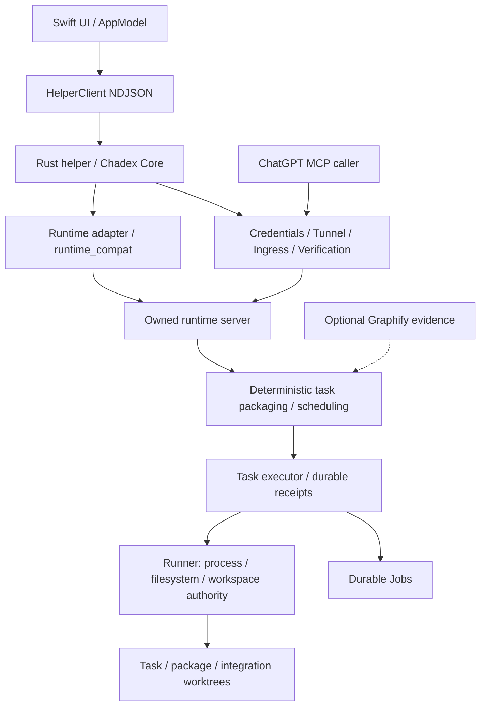

# Chadex Phase 13 全專案 audit 與 optimization review

日期：2026-09-21。審查性質：architecture、source、既有 reports／benchmarks、隔離 runtime probes、選定測試；沒有修改 production code、沒有 commit／push／release。

## 1. 結論與版本邊界

**不建議全面重寫；目前也不適合只補 release packaging 就發布。** Swift → Rust helper → owned runtime → Runner 的方向合理，工作區隔離、dirty snapshot、結果不確定時停止自動重試等重要基礎已存在。最大的缺口是各層契約尚未接合：預設授權不能建立執行工作區、長 process 交給 Job 後外層 task 無法接續、adaptive timeout 與上層等待期限不一致、recovery metadata 和 cleanup 並非完整可恢復交易。

這些問題會直接影響使用者完成任務，不只是 code quality。Phase 14 應以「execution lifecycle closure + fresh-install integration + release gates」為主；先不增加平行度、不再加第二個 planner、不引入第二套 recovery store。

沒有確認 P0。這不代表全面安全認證或所有 failure mode 都已被排除。

審查開始時 HEAD 是 `7c2eacb652f85900e5776c8cacbc7e7dafa6ed4a`，當時工作樹乾淨。主要 packaged runtime probes 與完整 Swift/helper 測試使用這個時間點的來源／bundle。審查期間另有工作加入以下 commits：

- `20a3911`：同 endpoint 切換專案時保留 tunnel，加入 pause/drain。
- `78bea25`：missing switch target fail closed。
- `b717b1cd6b465c5b9a6596fdc1b38080f0a5f4f4`：執行中的 app 改包裝到 `-next.app`；檢查 server／Runner binary generation；新增 cwd permission diagnosis。

本報告的 source 結論已補查到 `b717b1c`。上列修改沒有改掉 A01–A06 的核心問題；A07 是針對新加入的 pause/drain。**沒有宣稱早先 bundle 的實測等於重新測過 b717b1c packaged app。** 最新增量另跑 Swift protocol、helper bridge／binary-generation 測試。既有切換修正與 running-bundle 保護已列為正向改進，不再當成尚未實作功能。

穩定證據摘要：[2026-09-21-phase13-evidence.json](../../docs/audits/2026-09-21-phase13-evidence.json)。原始 probes／logs 留在 `/tmp/chadex-audit-*`，不是 release artifacts。

## 2. Architecture／reliability／performance 評估

| 面向 | 評估 | 實際意義 |
| --- | --- | --- |
| Architecture | 核心分層合理，lifecycle ownership 不完整 | 不需要移除 Swift/Rust 邊界；需要指定誰持有 task、Job、deadline、workspace lease 的權威狀態 |
| Reliability | 單步防護較成熟，長任務／跨階段／重啟閉環未完成 | component tests 通過仍可能在 fresh-install 與正式 gateway 路徑失敗 |
| Performance | 有效能改善證據，但 worktree 開銷、記憶體累積與同步 persistence 更值得先做 | 優先改善完成整個任務所需時間與失敗重做成本，不能只追單次 RPC latency |
| Security | 有多層 fail-closed、防越界與秘密處理；不是 child-process OS sandbox | cwd／allowed roots 不能保證任意授權 executable 不存取 cwd 外的檔案 |
| Maintainability | owned runtime 已落地，但 executor 與兩條 workflow 的責任仍偏重 | 適合沿 lifecycle contract 漸進抽出少量元件，不值得全面重新命名 inherited modules |
| Release readiness | 尚有明確 blockers | 要補 integration gates、發行簽章／notarization、完整 artifact identity 與乾淨機器驗證 |

責任邊界建議：Swift 只負責呈現、使用者意圖與有期限的請求；helper 負責 native lifecycle、connection epoch、project selection 與投影；runtime 負責 task／Job 狀態與 recovery；Runner 負責 canonical path authority、process tree 與 workspace 操作。`execute_task` 是執行既定計畫的機械式 executor，不能將它描述成會自行再次呼叫模型規劃的 agent。

## 3. 優先級總表

P0＝立即停止使用／發布的已確認重大資料或安全事故；P1＝主要功能、lifecycle 或正式 release blocker；P2＝有實際收益的可靠性／效能／契約改善；P3＝可延後維護工作。

| ID | 優先 | 問題 | 證據強度 |
| --- | --- | --- | --- |
| A01 | P1 | fresh install 的 allowed roots 無法配置 managed worktree | packaged gateway 重現 + source |
| A02 | P1 | 長 process 變成 Job 後，task terminal unknown，缺 continuation | 65 秒工作實測 + source |
| A03 | P1 | Runner adaptive deadline 被 server 原始 timeout 提早截斷 | 2 秒 budget／持續進度實測 + source |
| A04 | P1 | manifest 寫入失敗被忽略、cleanup 中間態無法安全接續 | source 明確失敗路徑；未做真斷電測試 |
| A05 | P1 | helper 不回收已完成 JoinSet task，RSS 線性增長 | 30,000 次請求實測 + source |
| A06 | P1 | Swift bridge cancellation 與 shutdown 可能無限等待 | 實際 HelperClient + 無回應 helper 重現 |
| A07 | P1 | 最新 project switch drain 無期限且持有 tunnel mutex | 最新 source；並行 interleaving 尚未 live 重現 |
| A08 | P1／P2 | task projection 缺 project identity fence；verification 證據過寬 | 前者注入晚到 snapshot 重現；後者 source／現有測試 |
| A09 | P2 | Phase 13 failure taxonomy 覆寫 ambiguous mutation | executor 測試 65 pass／1 fail |
| A10 | P2 | Graphify freshness／corpus／證據語意與 parsing 開銷 | graph metadata、source、歷史 benchmark |
| A11 | P2 | fsync／全域鎖／無限歷史掃描造成不必要阻塞 | source；尚未做當前 p95 壓測 |
| A12 | P1 | release gate 未涵蓋 runtime，發行流程未閉環 | scripts／artifact inspection／實際漏出的測試失敗 |
| A13 | P2 | tunnel binary trust 與 probe child lifetime 需要收斂 | source；未證明遠端可利用漏洞 |
| A14 | P3 | inherited runtime 範圍、重複 orchestration 與 docs drift | dependency tree／source／文件 |
| A15 | P2 | adaptive artifact scan 的 entry 上限不是真正枚舉上限 | source |

## 4. 主要問題、影響與驗收

### A01 — 預設安全範圍與 worktree 位置互斥（P1）

新資料目錄只選定一個 Git 專案時，Runner policy 只有該專案的 exact root，`allow_cwd_anywhere=false`。`choose_managed_worktree_root` 要從允許的 root 下建立 `.webcodex-managed-worktrees`，又禁止目的地位於 source 內，因而沒有合法候選。正式 `execute_task` 的 process／edit／validate 路徑需要隔離工作區，會在開始工作前失敗。

證據：[managed_worktree.rs:195](../../runtime-engine/crates/chadex-runtime-runner/src/webcodex_runner/projects/managed_worktree.rs:195)、[execution_workspace.rs:406](../../runtime-engine/src/tool_runtime/execution_workspace.rs:406)。隔離的 packaged helper、server、Runner，使用正式 MCP gateway：`workspace_prepare_failed / managed_worktree_root_unavailable`，`worktree_created=false`，最外層卻是 `execution_state=unknown`。不同 probe 約 0.6–1.8 秒即失敗。測試 fixture 額外明確授權其 parent 後，同一工作流能繼續，支持根因判斷。

建議建立 app 管理、與 source identity 綁定的 workspace capability／root，讓 Runner 明確授權該受控工作區；不能以預設放寬 HOME 或所有 parent directory 解決。prepare 尚未造成效果時應回傳明確 `not_started`。

驗收：全新 `CHADEX_DATA_DIR`、只選一個專案、不手改 policy，經正式 gateway 完成 edit → validate → review → apply-back → cleanup；同時拒絕 sibling／symlink 越界。

### A02 — task 和 Job 各自有狀態，卻沒有接續契約（P1）

`run_process` 有同步觀察上限及 Job handoff；executor 的 step 將同步等待限制到 60 秒。返回 Job running 後，`result_requires_observation` 把 task 帶入 `job_observation_required`／terminal unknown。validation 也將外部 Job observation 當成不能繼續的結果。雖保留 Job ID，卻沒有讓同一 task 在 Job 結束後回到後續 review／apply-back 的 supervisor。

證據：[chadex_task_executor.rs:3222](../../runtime-engine/src/tool_runtime/chadex_task_executor.rs:3222)、[chadex_task_executor.rs:4847](../../runtime-engine/src/tool_runtime/chadex_task_executor.rs:4847)、[process.rs:818](../../runtime-engine/src/tool_runtime/process.rs:818)。使用已明確授權工作區的 disposable fixture：Python 執行 65 秒，task budget 120 秒、process budget 90 秒；外層 **63.021 秒返回 unknown**，內層 Job `execution_state=running`；再觀察 8 秒，隔離工作區出現完成 marker，但 task 不接續。這不是已證明取消 child 失敗，而是「觀察窗口結束」被錯當成「task 不可接續」。

建議 runtime 內以既有 task／execution receipt 擴充 durable supervisor：step 持有 Job reference、繼續 observation、重啟後 reconciliation；短工作保留 inline fast path，長工作回傳同一 execution handle。定義 task cancel 如何傳至 Job／process tree、何時持久化 acknowledged cancellation。**不能以重播整個 mutation plan 代替 resume。**

驗收：超過 60 秒和 150 秒的工作，client disconnect／helper restart 後仍能觀察相同 execution；完成、取消、process lost 三種結果各自收斂；unknown 不自動重試。

### A03 — soft timeout、hard timeout、transport wait 尚未對齊（P1）

Runner 對 build／test 使用進度感知的 soft／hard budget；server 同步等待仍是原始 `timeout_secs + 2`。因此 Runner 正常延長執行，上層先回報 outcome unknown。另有 task 最大 600 秒、MCP dispatch 150 秒、HTTP 300 秒與 Job 同步等待上限，缺同一個絕對 deadline 模型；排程 semaphore 等待也不帶 cancellation／deadline。這些差異不是單純「時間設定太短」。

證據：[process.rs:979](../../runtime-engine/src/tool_runtime/process.rs:979)、[shell.rs:95](../../runtime-engine/crates/chadex-runtime-runner/src/webcodex_runner/shell.rs:95)、[mcp.rs:78](../../runtime-engine/src/mcp.rs:78)、[execution_workspace.rs:214](../../runtime-engine/src/tool_runtime/execution_workspace.rs:214)。名為 `cargo` 的 harmless fixture 持續印進度約 6 秒，`timeout_secs=2, sync_wait_secs=2`，約 **4.014–4.080 秒回 outcome_unknown**。其中一次回傳後 marker 繼續產生；另一次短觀察窗口未看到 marker，不能宣稱每次都有回傳後副作用。

建議一個 typed `ExecutionBudget`：absolute hard deadline、soft/stall policy、sync observation window 分開；排隊、重試、所有 validation checks 共同消耗剩餘 hard budget。transport timeout 只結束觀察，交還 execution handle；真正 hard timeout 必須有 child termination／reconciliation 結果。不要全面把所有 timeout 拉長。

### A04 — recovery 的 durable intent 與 cleanup 中間態不足（P1）

`persist_workspace_manifest` 回傳 `()`，create/write/sync/rename 失敗直接 return；呼叫方仍可繼續執行。workspace 建立／註冊與 manifest 之間存在 crash window。file fsync 後 rename 沒有 parent directory fsync，而 task receipt 的其他寫入已有較完整做法。

cleanup 先確認 registry ownership，再 unregister，最後 `git worktree remove`。若 unregister 成功後刪除失敗或 process 被殺，下次相同 cleanup 先要求 registry identity，已不存在時只能 `ownership_unknown`。不盲刪是正確的，但沒有可恢復的 staged cleanup。apply-back 已成功而 cleanup 失敗時，execution result 和 cleanup debt 也容易混成 unknown。

證據：[execution_workspace.rs:920](../../runtime-engine/src/tool_runtime/execution_workspace.rs:920)、[execution_workspace.rs:1110](../../runtime-engine/src/tool_runtime/execution_workspace.rs:1110)、[chadex_task_executor.rs:2024](../../runtime-engine/src/tool_runtime/chadex_task_executor.rs:2024)。此項以 source 中可達失敗路徑為證據，**沒有執行 disk-full／斷電／所有 kill-point matrix**。

建議在同一套 receipt／manifest 增加 persist-before-effect intent、operation identity、exclusive lease、cleanup phase 與完整寫入錯誤傳遞；明確區分 `execution succeeded + cleanup_pending`、效果 unknown 與純觀察失敗。不要只反轉 unregister／remove 順序，兩個資源間仍需要可重入的 transaction stages。Recovery retry 是新 attempt，resume/reconcile 是查明既有 attempt；產品與 API 必須分清。

驗收：對 create→register→persist→execute→apply→unregister→remove 每個相鄰邊界做 kill/restart；disk-full、readonly state dir、rename 失敗、缺 registry、缺 worktree、身份不符、symlink、外部 source writer 都需有不破壞資料的結果。既有 recovery identity 不足時保留並要求明確處置，不猜測所有權。

### A05 — helper 有可測量的長期記憶體累積（P1）

`run_async` 對每個請求 `JoinSet::spawn`，但只在 stdin EOF／shutdown 後 `join_next`；正常運行不回收完成的 task。30,000 次順序 `getStatus`：

| 請求數 | helper RSS |
| ---: | ---: |
| 0 | 3,248 KiB |
| 10,000 | 133,200 KiB |
| 20,000 | 262,336 KiB |
| 30,000 | 379,072 KiB |

證據：[runtime_bridge.rs:900](../../rust-helper/src/runtime_bridge.rs:900)。測試未啟動真實 tunnel、未使用真實憑證。這是過程內 RSS 的實測增長，並非只是推測 allocator 有 cache。來源與 Tokio `JoinSet` 的完成項目需要 join 取出契約一致：[Tokio documentation](https://docs.rs/tokio/latest/tokio/task/struct.JoinSet.html)。

建議在讀取請求迴圈同時 drain completions，限制 in-flight requests 與 NDJSON line bytes，shutdown 也要取消／收斂既有 tasks。驗收至少 100,000 次請求，RSS 在暖機後不持續線性增長，慢請求不阻塞狀態查詢。

### A06 — Swift bridge 沒有完整的請求生命週期（P1）

`withCheckedThrowingContinuation` 登記後沒有請求 deadline 或 cancellation handler。`shutdown()` 先 await helper 的 shutdown response，才進入後面的 5 秒 process wait；所以 watchdog 不能涵蓋 helper 不回應的情況。兩次分開寫 JSON／newline 也沒有明確序列化 writer，並行呼叫有 frame interleaving 風險。

證據：[HelperClient.swift:90](../../Sources/ChadexApp/HelperClient.swift:90)、[HelperClient.swift:155](../../Sources/ChadexApp/HelperClient.swift:155)。編譯實際 `Models.swift + HelperClient.swift`，搭配不回應的 fake helper：取消 request 後 continuation 未完成；呼叫 shutdown 6 秒後仍未完成。writer interleaving 是 source risk，未重現。

建議統一 request actor／serial writer、單次寫出完整 frame、process generation fence、pending request 上限、deadline／取消時 exactly-once resume。從 shutdown 開始就計時，逾期終止自己的 helper tree，不能等待同一條已失效 RPC 才啟動 watchdog。

### A07 — 最新 pause/drain 會放大長連線與停止等待（P1）

新的 `pause_and_drain` 設 accepting=false，再等待全部 32 個 admission permits。permit 持續由 `TracedResponseStream` 持有至 stream 結束／丟棄；drain 沒有 timeout／cancellation。`TunnelManager::pause_ingress` 又在等待期間持有 `inner` mutex；stream 不結束時，不只 project switch，stop／其他需要該 mutex 的流程也可能卡住。HTTP client 只設定 connect timeout，不能替整個 response stream 提供上限。

另有很短但合法的多執行緒 interleaving：request 先讀 accepting=true → pause 取得全部 permits、完成 drain 並釋放 → request 才 acquire permit；request 在 acquire 後沒有重新檢查 accepting／epoch，可能在切換期間進入 backend。現有註解描述的 fail-closed 並未涵蓋這個窗口。

證據：[verification.rs:201](../../rust-helper/src/chadex_core/verification.rs:201)、[verification.rs:243](../../rust-helper/src/chadex_core/verification.rs:243)、[tunnel.rs:478](../../rust-helper/src/chadex_core/tunnel.rs:478)。這是 b717b1c 的 source finding，尚未透過 live stalled stream 重現，不能算已觀察的使用者事故。

建議有期限的 quiescence、不跨 stream drain 持有 tunnel mutex；admission 原子地綁 generation，取得 permit 後重新驗證 accepting／generation。逾期終止觀察通道不等於宣告已取消底層 mutation，執行狀態仍由 task supervisor reconcile。驗收包括永不結束的 stream、slow reader、switch／stop 競爭與舊 request 延遲取得 permit。

### A08 — project identity 必須貫穿投影與 verification（P1／P2）

**P1：task projection。** 切換時刪除全域 `state/latest.json`，不能阻止舊 task 稍後再寫。`task_progress()` 檢查 snapshot 是否 presentable，卻未確認是目前選定 project。隔離 helper 選 B 後注入 A 的晚到 active snapshot，實測 `selected_project_is_B=true`、`task_project=fixture_project_A`、UI-facing snapshot 仍可見。這是受控晚到 publication 注入，並非已跑完整 A/B 並行 mutation race。

證據：[runtime_bridge.rs:291](../../rust-helper/src/runtime_bridge.rs:291)、[runtime_bridge.rs:371](../../rust-helper/src/runtime_bridge.rs:371)。以 per-project execution query／projection 和 canonical identity fence 取代刪除 latest；UI cancel 的目標也必須是畫面所呈現、確認過 identity 的 execution。

**P2：verification semantics。** `ResponseEvidence` 只記錄 request `(id, method)`，任何成功 `tools/call` 都可能讓目前 epoch 變 verified；沒有證明執行的是 selected-project read。成功的 runtime status 或另一個已授權 project 操作都不足以證明現在選定資料夾已可讀。現有 epoch fence、bounded JSON/SSE parser、ID matching 值得保留，但 connection verified 與 project-read verified 應分開。

證據：[response_evidence.rs:35](../../rust-helper/src/chadex_core/verification/response_evidence.rs:35)。建議從 runtime 的權威執行結果取得 project identity／operation proof，不能只信 request 中任意填入的 path。驗收切換、延遲回應、成功 non-project tool、不同 project tool、失敗 read 與真正成功 read 的狀態差異。

### A09 — typed outcome 比從 log 猜測原因更可靠（P2）

executor focused suite **65 passed／1 failed**：`execute_task_never_retries_ambiguous_mutation_outcome` 預期 `ambiguous_mutation`，實際 `interruption`。Phase 13 新 failure reason/category 投影覆寫既有 outcome category。測試中的 **不自動 retry invariant 仍成立**，沒有證明重複 mutation。另一方面，明確 dispatch 前拒絕也可能因缺少 `state_changed`／exit_code 被升為 unknown；隔離 probe 中 `/bin/sh -c` 在拒絕後就走到這個結果。

證據：[chadex_task_executor.rs:640](../../runtime-engine/src/tool_runtime/chadex_task_executor.rs:640)、[chadex_task_executor.rs:4906](../../runtime-engine/src/tool_runtime/chadex_task_executor.rs:4906)、[tests/chadex_task_executor.rs:1803](../../runtime-engine/src/tool_runtime/tests/chadex_task_executor.rs:1803)。

建議共用 typed outcome：dispatch_state、effect certainty、terminal reason、retryability 分開。不要只把測試 expected 改成 interruption；stdout/stderr 中包含 cancel／timeout 字詞也不能主導控制語意。驗收同時涵蓋 not_started、known failure、timeout killed、observation lost、ambiguous mutation。

## 5. 最值得做的效能與 strategy 改進

### A10 — Graphify 改為小而可信的可選 navigation／dependency evidence（P2）

本地 graph 約 58 MB、57,621 nodes、171,024 edges，`built_at_commit=061535cd2f5eb22fb01b0ee6126a0af209a151f2`，落後目前來源。節點來源含 `vendor/` 約 23,404、`runtime-engine/` 約 19,043；`.graphifyignore` 對目前來源／build outputs 的範圍也應重新整理。直接以整張圖推斷當前安全性不成立。本次只讀 graph／既有 traversal，沒有 auto-index 或重新建立圖。

來源：[chadex_task_executor.rs:66](../../runtime-engine/src/tool_runtime/chadex_task_executor.rs:66)、[chadex_task_executor.rs:1374](../../runtime-engine/src/tool_runtime/chadex_task_executor.rs:1374)。目前值得挑戰的策略：每個合適的 task 啟動 Python／parse graph，再判斷 freshness；「未發現強依賴邊」被投影成 parallelism proof，語意強於圖所能證明。抽取缺漏、shared generated files、global resources、測試互相影響不一定有圖邊。

建議先讀輕量 manifest／content digest，fresh 才載入需要的 file-level adjacency；按 graph digest 快取並限制 bytes／解析時間。並行仍需明確 write/resource set、獨立 workspace 與整合驗證；圖只能否定或降低並行、提示待觀察項目，不能把 no-edge 當作完整獨立性證明。Graphify 缺失／過期時仍能完成正常工作，不增加額外付費模型依賴。

歷史 Phase 10D report 中 large case 約 **635.338 → 711.211 ms（+11.94%）**，Graphify planning 約 **94.5 ms**；這個資料不支持「所有工作預設 Graphify 都更快」。參考 [Phase 10D report](../../docs/performance/phase10d-adaptive-packaging.md)。沒有目前版本的品質提升 A/B 證據。

### Workspace 成本比增加 worker 更值得處理

歷史 [Phase 11 connected-runtime benchmark](../../benchmarks/phase11-task3-connected-runtime.json) 的 2-run median：8 秒工作 connector total 約 31.821 → 26.748 秒，12 秒工作約 44.891 → 30.029 秒；較長獨立工作確實受益。另一方面 lifecycle overhead 約 15.5–15.8 秒，prepare 約 6.56–6.89 秒、cleanup 約 5.67–5.83 秒。這是保存下來的歷史 connector/runtime 數據，**不是本次最新 ChatGPT Web E2E 實測**。

下一步先測 build cache cold/warm、dirty snapshot 大小、workspace prepare／integration／cleanup 各自 p50/p95。適合採用有 owner／generation 的 `WorkspaceLease`，讓同一 execution 的 Job／recovery 接續既有 workspace；toolchain／project／revision 對應的 cache reuse 要防污染。不應為省時間移除隔離，也不要讓並行 build 無鎖共用可寫 `target`。

保留小工作 sequential fast path；以實際成本與每專案／toolchain／cache 狀態校正 cost gate，避免僅以 timeout 比例估計工作量。task／executor 上限應保守，沒有證據支持現在再提高。

### A11 — durable state 與 UI projection 分開（P2）

executor 的全域 persistence mutex、task mutex 內同步 filesystem I/O、多次 file/directory fsync 會阻塞 async worker。每次 UI-visible 更新不都需要同等 durability。restore receipts 隨歷史數量掃描，dedup tombstones／recovery payload 的 retention 也需要政策。

證據：[chadex_task_executor.rs:2391](../../runtime-engine/src/tool_runtime/chadex_task_executor.rs:2391)。建議只有 dispatch-before-effect、terminal result 等 durability barriers 必須完成同步確認；UI projection 可合併寫入，其他 I/O 經有上限的 writer／blocking pool，避免鎖內 fsync。清理 completed payload 時保留必要 dedup identity／effect receipt；不能靠刪 tombstone 省空間而重新允許重複 mutation。這是 source-based bottleneck candidate，尚未量測本版 p95，應先 instrument 再決定是否換儲存格式。

歷史 [Phase 12 benchmark](../../benchmarks/phase12-execution-semantics.json) 約 read 23.16 → 54.23 ms、edit 1050.47 → 1079.14 ms；這是 local harness、約 +30 ms 的成本，不可誤稱 production regression 或必須犧牲 durability 的理由。

### A15 — adaptive 觀察本身也要真正 bounded（P2）

[shell.rs:200](../../runtime-engine/crates/chadex-runtime-runner/src/webcodex_runner/shell.rs:200) 的 artifact scan 在 pop 時才扣 remaining，目錄 enumerating／push entries 時沒有消耗同一 budget，單一大目錄仍可能大量配置；`metadata` 也跟隨 symlink。CPU progress 採外部 `ps`，缺少明確 probe wall deadline。建議 enumeration count／stack size／wall time 三種上限、skip symlink、bounded CPU sampler。command class 應優先由 typed argv／purpose 提供，避免 shell comment 或任意 substring 被辨認成 build。

## 6. Security、歷史依賴與 release

### A13 — 保留現有邊界，收斂 production binary trust（P2）

已存在且值得保留：credentials 在 helper/native 層處理、下載 tunnel client 的 SHA 校驗、loopback-only upstream、no_proxy／no_redirect、bounded ingress／verification evidence、Runner canonical-root guards、process tree 管理、private recovery files、unknown 不自動重試。沒有發現必須因本次審查立刻移除的功能。

但 production tunnel client resolution 可經 PATH／override，候選的 `--version` 判斷和下載 artifact 的 checksum trust 不相等；取得秘密環境變數前，應明確限制正式版接受的 artifact／checksum，開發 override 額外標記。version probe 使用 timeout 包住 output，仍應明確 kill-on-drop／reap 與限制輸出。這是本機可執行檔信任與資源管理 hardening，不能描述成已證實可遠端竊取 token。

source worktree guards 是 tool authority／隔離保護，並非對任意 shell 子程式的 OS sandbox。外部程序可依使用者權限產生 cwd 以外副作用；對 apply-back 的重查也不是任意外部 writer 的全域鎖。應把安全保證寫準，不以新 sandbox 大改阻塞 v0.1.0；若未來產品需要真正不可信 code execution，才獨立設計 sandbox subsystem。

### A14 — WebCodex remnants：區分 provenance、名稱與實際 dependency（P3）

本次 `cargo tree` 的 production dependency graph 沒有 `webcodex-*` package identity 或 `vendor/webcodex` path dependency。現在的 `runtime-engine/` 是 owned runtime；`vendor/webcodex` 與 attribution 應視為歷史／授權來源，不能因 grep 到 WebCodex 就判斷產品仍需要舊 Tauri runtime。保留必要 LICENSE／UPSTREAM。

實際 debt 是 owned runtime 仍帶有上游廣泛 server／OAuth／admin／plugin／remote／computer／LSP 等模組與共用 namespace，不等於這些功能全部對外啟用，也不等於已發現漏洞。release 後可做 local-desktop capability profile：按 callgraph、route exposure、dependency／binary size 實測收斂 compile features。不要先做大規模改名或無證據刪除。

`coding_task`／work_on_project 與 execute_task 仍有相近 workspace／orchestration 流程；可先共用 WorkspaceLease、Budget、Outcome，不急著把不同 API／UX 強併成一個巨型 executor。文件 `ARCHITECTURE.md` 的 phase／switch 描述與部分 benchmark commands 已落後，應在 Phase 14 收尾更新。

### A12 — v0.1.0 必須有獨立 release gate（P1）

1. [scripts/test.sh](../../scripts/test.sh:1) 只跑 Swift／helper，未涵蓋 runtime-engine；本次 executor category regression 可穿過這個 gate。要加入 task／workspace／process／contracts 與最小 packaged integration，區分環境不允許 network/ps 的測試。
2. [validate_architectures.sh](../../scripts/validate_architectures.sh:24) 只驗 Swift／helper，未涵蓋 server、Runner、CLI。可明確首版 arm64-only；若宣稱 Intel／Universal，須完成所有 binaries 與 runtime smoke，不能用 helper cross-check 當證據。
3. [build_app.sh](../../scripts/build_app.sh:1) 使用 dogfood runtime、release helper／Swift，版本固定 0.1.0／1。這不自動意味效能不足；需要明確 release profile、版本注入、source/tree identity 與完整 artifact manifest。最新 running-bundle 保護是改善；仍建議最終 staging／atomic publish，避免很早檢查一次後到替換之間的窗口。
4. 沒有 root `.github/workflows` release pipeline；目前 script 的 Apple Development／adhoc fallback 不等於面向外部使用者的分發流程。本次 inspected bundle 為 arm64，code signature flags 未顯示 hardened runtime。正式發行應定義 Developer ID、Hardened Runtime、notarization／stapling 與乾淨環境 Gatekeeper 驗收。依據：[Apple Developer ID](https://developer.apple.com/developer-id/)、[Apple notarization documentation](https://developer.apple.com/documentation/security/notarizing-macos-software-before-distribution)。
5. 歷史 benchmark harness 的 binary candidates／hash collection 有舊 `webcodex-runtime`／`webcodex-*` 名稱，部分 direct execute_task call 已與目前 `call_runtime_tool` gateway 不符。先共用目前 IsolatedHarness／canonical schema／binary identity，才用它做 release A/B，避免測到舊 binary 或根本被拒絕的 call。
6. 本次 sandbox 內 `codesign --verify --deep --strict` 得到 `CSSMERR_TP_NOT_TRUSTED`，不足以判定簽章本身損毀。後續要求正常環境執行 read-only codesign／spctl 時，automatic approval review 因 workspace credits 耗盡而拒絕，**並未執行**。正式 trust／Gatekeeper 結論仍未驗證。

## 7. 不建議再動的設計

- Swift UI 消費 Rust truth-based snapshots，不要把 runtime state machine 搬回 Swift。
- owned runtime 邊界、native helper／server／Runner 分工，沒有足夠收益支持全面換語言、改單一巨型 process 或換框架。
- dirty tree 的 temporary Git index／detached worktree／reconciliation；保留 source HEAD、index、stash，不以自動 stash 或直接在 source 執行替代。
- durable mutation identity、terminal receipt、unknown 不自動重試；不要為「看起來恢復很快」削弱它們。
- Graphify optional、bounded context、批次獨立 observation、read revision guard、短任務 sequential fast path。
- 最新 project switch 的 endpoint reuse、epoch fencing、missing target fail-closed 與 binary generation guards；補 lifecycle 缺口即可，不需全部退回重啟 tunnel。
- attribution／UPSTREAM 記錄與必要歷史命名；改名本身不是效能或安全改善。

## 8. Phase 14 建議範圍與 exit gates

| 順序 | 工作包 | 必須可展示的 exit evidence |
| --- | --- | --- |
| 14.1 | 修正 fresh-install workspace authority + typed not_started | 新資料目錄、exact project root 的完整 mutation workflow 成功；越界仍拒絕 |
| 14.2 | 統一 Budget／Outcome + Job continuation supervisor | >60s／>150s 工作、disconnect、restart、cancel、queue timeout；相同 execution 可觀察、不重複 mutation |
| 14.3 | 完成既有 recovery transaction／cleanup stages | kill-point／disk I/O fault matrix；apply success 與 cleanup pending 可分辨，未知 ownership 不刪除 |
| 14.4 | 修 helper leak／Swift bounded RPC／switch quiescence | 100k status soak、無回應 helper 可退出、stalled stream 不封死 stop、project identity race tests |
| 14.5 | canonical integration + release gates | runtime／contracts suite、目前 bundle identity、修正 benchmark harness、乾淨 app package／簽章、真實 ChatGPT Web evidence |

14.2 應先定義小型共用 contract，再逐層接線；不需要先拆整個 6,000+ 行 executor。14.3 沿現有 receipts／manifests 實作，不另建與舊資料競爭的新 recovery engine。

release 的最低要求：P1 關閉、A09 已確認 regression 修正、A08 verification 語意清楚、所有 P2 有明確接受／延後理由；Architecture complete、Integration verified、Release ready 分別記錄。不能以 Phase 13 單元測試或 local connector benchmark 取代真實 ChatGPT Web、重啟／切換／長任務與外部安裝證據。

## 9. 適合 v0.1.0 後再做

| 項目 | 延後原因／前提 |
| --- | --- |
| Graphify adjacency cache、增量索引、抽取 coverage 指標 | 先修 freshness／proof 語意與限制；目前沒有證據需要更大的圖 |
| Workspace pool、compiler cache integration | lifecycle 正確後才有安全且可量測的 reuse 基礎 |
| runtime local-desktop feature profile | 需先量 dependency／route／binary size，避免移除隱含能力 |
| executor／coding_task 結構拆分 | 先建立共用 contract，再按維護成本拆分；不只追求行數 |
| 大規模 persistence schema／database 替換 | 現有 receipt 模型可先修對；只有 contention／retention 測量支持才更換 |
| 更積極的 parallel planning／更高 concurrency | 先解 worktree 成本與 Job continuation；保留 cost gate |
| 額外 planner agent、必需模型服務、新 OS sandbox subsystem | 屬新產品能力／威脅模型，非目前 release closure 的必要條件 |

A05 記憶體、A06 shutdown、A01 預設執行失敗、A02/A03 長任務與 A04 recovery 不適合留到 release 後。

## 10. 本次實際驗證、限制與重現方式

| 驗證 | 結果 | 版本／限制 |
| --- | --- | --- |
| Swift full suite | 26 passed | 初始 7c2eacb；visual tests 生成的 9 個 tracked previews 已只還原本次產物 |
| Rust helper full suite | 124 passed、3 ignored | 初始版；sandbox 首跑有 5 個 bind 限制，正常 loopback 許可下重跑通過 |
| Swift ProtocolModelTests | 15 passed | 最新 b717b1c 增量 |
| helper bridge + binary-generation | 7 + 1 passed | 最新 b717b1c 增量；不是再次全套 network test |
| task executor focused suite | 65 passed、1 failed | failure category 回歸；未知效果不 retry 仍成立；相關 executor 源碼最新增量未變 |
| execution_workspace suite | 8 passed | 本次執行 |
| Runner managed_worktree suite | 8 passed | 本次執行；不涵蓋 native fresh-install policy 接線 |
| Runner Phase 13 focused suite | 4 passed、1 failed、1 ignored | silent CPU test 失敗；sandbox 禁止 `ps`，單獨重跑同樣失敗，不能判定正常 macOS 產品回歸；real optimized build test 未執行 |
| packaged gateway probes | A01／A02／A03 重現 | 隔離 state、disposable Git fixtures、無真實 credentials；初始 bundle hashes 存 evidence JSON |
| helper RSS／Swift hanging helper／晚到 project projection | 問題重現 | 後兩項為故障注入；不是本次 live user project mutation |
| production cargo dependency tree、shell syntax、Git diff check | 已檢查 | 無 vendor package path；未執行整個 runtime 所有數千項測試 |

本次沒有：真實 ChatGPT Web 新的 end-to-end performance／verification、所有平台 runtime、完整 fuzz／security dependency advisory scan、完整 crash/power-loss matrix、正式 notarization、GitHub release、全面效能 profile。報告中的 source findings、歷史 benchmark、隔離實測與最新版增量證據分別標示，不能互相替代。

可重跑的最小測試入口：先依 `scripts/rust-env.sh` 選用專案 toolchain，再執行 helper tests、runtime `chadex_task_executor`／`execution_workspace` filters、Runner `managed_worktree`／`phase13` filters；Swift 只跑 protocol tests 可避免覆寫 visual preview fixtures。Fresh-install E2E 必須經目前 MCP gateway 並給獨立 data dir；不要直接使用使用者現有 runtime、token 或專案工作樹。raw probe 腳本位於 `/tmp/chadex-audit-runtime-{probe,extended,long}.py`，不是加入產品的程式變更。
